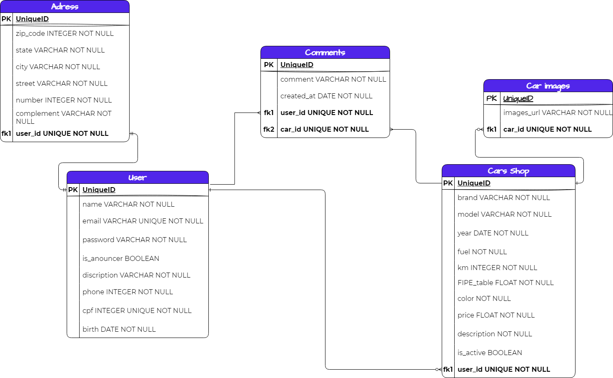

# Motors Shop

Esta aplicação funciona como um site para venda de carros. É possível registrar-se, como anunciante ou comprador, como anunciante você ganha opções de registrar carros, informações sobre ele como marca, modelo, combustível, ano, etc. Além disso, pode adicionar 6 fotos sobre o carro e uma descrição, também temos a tabela FIPE, que serve como parâmetro para sugerir preço para o carro, quando cadastra marca e modelo, ela sugere automaticamente o preço ideal que o carro sendo cadastrado deveria ter, claro que fica a critério do cliente seguir ou não essa sugestão.
Ourossim, é que todos os clientes do site podem comentar nos carros, tem uma seção de comentários onde as pessoas podem comentar quantas vezes quiserem em um carro específico ou podem editar e excluir seus próprios comentários também. 
A aplicação, possui ainda mais funcionalidades, vem dar uma conferida.


Link para o back-end da aplicação: [Motors Shop Back-End](https://github.com/bj-mandim/-projeto-final-m6-back-end)


 ## <strong>ER Diagrama: </strong>
 <br><br>


 Tecnologias utilizadas:

 - ReactJS
 - Typescript
 - Styled Components
 - TypeORM
 - NestJS
 
 **Base URL:** https://kenzie-cars.vercel.app/

 **Documentação:**
 
**Link do swagger** https://motor-shop-aty2.onrender.com/api


 ## **Devs**

 > - [Amanda R. Costa](https://www.linkedin.com/in/amanda-fullstack/)
 > - [Beatriz Mandim](https://www.linkedin.com/in/beatrizmandim/) 
 > - [Elias Borges](https://www.linkedin.com/in/eliasborgess/)
 > - [Gabriel Werneck](https://www.linkedin.com/in/gabrielwwerneck/)
 > - [Mateus Santanna](https://www.linkedin.com/in/mateussantanna/)

---


## Iniciando:

Para iniciar a aplicação basta seguir o scrip abaixo:

Na pasta back-end. Escreva o seguinte comando no terminal:
### `yarn` ou `yarn install`

<br>

Crie um arquivo .env, seguindo o arquivo .env.example (é necessário criar um database usando postgresql).

<br>

Ainda na pasta back-end do projeto no terminal rode o seguinte comando:

### `yarn start`

<br>

Abra outra janela no seu vscode agora com o front-end da aplicação, deixe o back-end rodando o servidor.
Vá para a pasta front-end e rode o seguinte comando no terminal:

### `yarn` ou `yarn install`

Em seguida:
### `yarn start`

O terminal mostrará o link para abrir a aplicação em seu navegador. 
O link provavelmente será [http://localhost:3000/](http://localhost:3000/) para visualização. 

Se forem feitas mudanças no código do back-end, é preciso parar o servidor, salvar essa mudança, e fazer outro yarn start para verificar a mudança.\
É possível no console ver todos os erros.

Agora é possível abrir o insomnia e lá fazer as requisições, segue abaixo arquivo para importar:

Caso não deseje importar, apenas abra o insomnia e em um novo ambiente faça uma requisição do tipo POST usando a URL [http://localhost:3001/users](http://localhost:3001/users)
É possível pelo terminal do back-end ver todas as rotas existentes da aplicação caso hajam dúvidas.

---

## Modo de usar pelo insomnia:
---

## **Usuário**

## 1. Criar conta

- POST /users

Request:
Preencha as informações o mais correto possível, já que esse usuário teste provavelmente já existe.
```json
{
	"name": "teste",
	"email": "teste@teste.com",
	"is_announcer": true,
	"password": "123456",
	"description": "alguma descrição",
	"phone": "123456789101112",
	"cpf": "12345678911",
	"birth": "20/05/2010",
	"address": {
		"city": "Rio de Janeiro",
		"state": "RJ",
		"street": "Rua da casa",
		"number": 12,
		"complement": "Proximo a algum lugar, eu acho.",
		"cep": "123456-123"
	}
}
```

Response:
```json
{
	"id": "ca17f064-e41d-4692-b22c-e62acc0146e9",
	"name": "teste",
	"email": "teste@teste.com",
	"is_announcer": true,
	"description": "alguma descrição",
	"phone": "123456789012345",
	"cpf": "12345678901",
	"birth": "20/05/2010",
	"reset_token": null,
	"address": {
		"id": "ef436b61-3216-46bc-81da-a38e62bbd6b2",
		"cep": "123456-123",
		"state": "RJ",
		"city": "Rio de Janeiro",
		"street": "Rua da casa",
		"number": 12,
		"complement": "Proximo de algum lugar, eu acho."
	},
	"cars": []
}
```

---

## 2. Login

- POST /login
- A response dessa requisição é o token.

Request:

```json
{
  "email": "teste@teste.com",
  "password": "123456"
}
```
---

## 3. Listar usuário específico

- GET /users/:id
- Corpo da requisição é vazio.
- Author: Bearer Token

Response:

```json
{
	"id": "ca17f064-e41d-4692-b22c-e62acc0146e9",
	"name": "teste",
	"email": "teste@teste.com",
	"is_announcer": true,
	"description": "alguma descrição",
	"phone": "123456789012345",
	"cpf": "12345678901",
	"birth": "20/05/2010",
	"reset_token": null,
	"address": {
		"id": "ef436b61-3216-46bc-81da-a38e62bbd6b2",
		"cep": "123456-123",
		"state": "RJ",
		"city": "Rio de Janeiro",
		"street": "Rua da casa",
		"number": 12,
		"complement": "Proximo de algum lugar, eu acho."
	},
	"cars": []
}
```
---

## 4. Listar usuário

- GET /users/profile
- Corpo da requisição é vazio.
- É uma requisição para listar todos os usuários.

---

## 5. Atualizar usuário

- PATCH /users/:id
- É possível atualizar apenas o nome, ou apenas o email ou todos os campos ao mesmo tempo, no exemplo abaixo estou atualizando apenas o nome, mas basta passar as informações desejadas no corpo do json. O endereço é atualizado em uma rota separada, não aqui.
- Auth: Bearer Token

Request:

```json
{
  "name": "TesteAtt"
}
```

Response:

```json
{
	"id": "ca17f064-e41d-4692-b22c-e62acc0146e9",
	"name": "TesteAtt",
	"email": "teste@teste.com",
	"is_announcer": true,
	"description": "alguma descrição",
	"phone": "123456789012345",
	"cpf": "12345678901",
	"birth": "20/05/2010",
	"reset_token": null,
	"address": {
		"id": "ef436b61-3216-46bc-81da-a38e62bbd6b2",
		"cep": "123456-123",
		"state": "RJ",
		"city": "Rio de Janeiro",
		"street": "Rua da casa",
		"number": 12,
		"complement": "Proximo de algum lugar, eu acho."
	},
	"cars": []
}
```
---

## 6. Deletar usuário

- DELETE /users/:id
- Auth: Bearer Token
- Corpo da requisição é vazio.
- Para verificar se o usuário foi mesmo excluido basta tentar fazer login novamente, você receberá uma informação de erro.

---

## 7. Reset Password

- POST /users/resetPassword
- Para realmente verificar essa rota, inserir um email válido na requisição.

Request:

```json
{
  "email": "teste@teste.com"
}
```

Response:

```json
{
  "message": "Link para redefiniçaõ de senha enviado."
}
```
---

## 8. Reset Password (Atualizando a nova senha)

- PATCH /users/resetPassword/:token
- Pegar o token recebido no login e inseri-lo na rota
- Inserir na requisição sua nova senha.

Request:

```json
{
  "password": "Legal1234#"
}
```

Response:

```json
{
  "message": "Senha alterada com sucesso."
}
```
---

<br>

## **Endereço**

## 1. Atualizar endereço

- PATCH /users/:id
- É possível atualizar apenas uma informação, como o estado ou todos os campos ao mesmo tempo, no exemplo abaixo estou atualizando apenas a cidade.
- Auth: Bearer Token

Request:

```json
{
	"address": {
		"city": "Fui embora"
	}
}
```


Response:

```json
{
	"id": "ca17f064-e41d-4692-b22c-e62acc0146e9",
	"name": "TesteAtt",
	"email": "teste@teste.com",
	"is_announcer": true,
	"description": "alguma descrição",
	"phone": "123456789012345",
	"cpf": "12345678901",
	"birth": "20/05/2010",
	"reset_token": null,
	"address": {
		"id": "ef436b61-3216-46bc-81da-a38e62bbd6b2",
		"cep": "123456-123",
		"state": "RJ",
		"city": "Fui embora",
		"street": "Rua da casa",
		"number": 12,
		"complement": "Proximo de algum lugar, eu acho."
	},
	"cars": []
}
```
---

<br>

## **Carros**

---

## 1. Criar carros

- POST /cars
- Auth: Bearer Token
- Aqui o usuário pode passar a url que quiser em images, só deixei algumas salvas no exemplo abaixo para facilitar a requisição teste. Também é possivel fazer POST sem colocar imagem alguma, mas o array vazio de "images": [] precisa existir.


Request:

```json
{
	"brand": "porsche",
	"model": "teste",
	"year": 2019,
	"fuel": "gasolina",
	"km": 0,
	"fipe_table": "5.00",
	"color": "red",
	"price": "5000.00",
	"description": "carro zero",
	"is_active": true,
	"images":[
		{"url":"https://garagem360.com.br/wp-content/uploads/2022/05/Chevrolet-Blazer-electric-illustration.jpg"},
		{"url":"https://media.seudinheiro.com/uploads/2023/01/Blazer-EV-foto-Chevrolet.jpg"},
		{"url":"https://forbes.com.br/wp-content/uploads/2020/08/Neg%C3%B3cios-CarrosdeLuxo-180820-Divulga%C3%A7%C3%A3o9-1-768x512.jpg"},
		{"url":"https://encrypted-tbn0.gstatic.com/images?q=tbn:ANd9GcQOs42HtK77IXFH-w-wiRcsTseCqxmHIjCMM1zHiycEbPCwnFJDeGAVpamLJY5PQFEe7iY&usqp=CAU"},
		{"url":"https://s2.glbimg.com/34dXAGWv1SPKVN7Yq0Un4tqgQ-s=/0x0:1600x1067/924x0/smart/filters:strip_icc()/i.s3.glbimg.com/v1/AUTH_cf9d035bf26b4646b105bd958f32089d/internal_photos/bs/2023/9/Y/O78j0YTlaqqmhcl4lz5Q/polo-track.jpg"},
		{"url":"https://encrypted-tbn0.gstatic.com/images?q=tbn:ANd9GcQOs42HtK77IXFH-w-wiRcsTseCqxmHIjCMM1zHiycEbPCwnFJDeGAVpamLJY5PQFEe7iY&usqp=CAU"},
		{"url":"https://encrypted-tbn0.gstatic.com/images?q=tbn:ANd9GcQQjuGFM0LrCvnHJx0b8BED-GpYdp5yFgZkmH0jJYmgB1Nei8CSYkqK04cjR3mSFzJXDzU&usqp=CAU"},
		{"url":"https://encrypted-tbn0.gstatic.com/images?q=tbn:ANd9GcSpgtqBPVrJXQWeQo9Yt9AYdEevaXzldJlXfY-LDpK66ZkCe-Zoo3qQu4HZ1L3DZY2x2xk&usqp=CAU"}
	]
}
```

Response

```json
{
        "id": "d4f392dc-7109-4098-89c5-0d8e103430e8",
	"brand": "porsche",
	"model": "teste",
	"year": 2019,
	"fuel": "gasolina",
	"km": 0,
	"fipe_table": "5.00",
	"color": "red",
	"price": "5000.00",
	"description": "carro zero",
	"is_active": true,
	"user": {
	"id": "ca17f064-e41d-4692-b22c-e62acc0146e9",
	"name": "TesteAtt",
	"email": "teste@teste.com",
	"is_announcer": true,
	"password": "123456",
	"description": "alguma descrição",
	"phone": "123456789101112",
	"cpf": "12345678911",
	"birth": "20/05/2010",
	"address": {
		"id": "ef436b61-3216-46bc-81da-a38e62bbd6b2",
		"city": "Fui embora",
		"state": "RJ",
		"street": "Rua da casa",
		"number": 12,
		"complement": "Proximo a algum lugar, eu acho.",
		"cep": "123456-123"
	}
     },
     "images": [
     {"url":"https://garagem360.com.br/wp-content/uploads/2022/05/Chevrolet-Blazer-electric-illustration.jpg"},
		{"url":"https://media.seudinheiro.com/uploads/2023/01/Blazer-EV-foto-Chevrolet.jpg"},
		{"url":"https://forbes.com.br/wp-content/uploads/2020/08/Neg%C3%B3cios-CarrosdeLuxo-180820-Divulga%C3%A7%C3%A3o9-1-768x512.jpg"},
		{"url":"https://encrypted-tbn0.gstatic.com/images?q=tbn:ANd9GcQOs42HtK77IXFH-w-wiRcsTseCqxmHIjCMM1zHiycEbPCwnFJDeGAVpamLJY5PQFEe7iY&usqp=CAU"},
		{"url":"https://s2.glbimg.com/34dXAGWv1SPKVN7Yq0Un4tqgQ-s=/0x0:1600x1067/924x0/smart/filters:strip_icc()/i.s3.glbimg.com/v1/AUTH_cf9d035bf26b4646b105bd958f32089d/internal_photos/bs/2023/9/Y/O78j0YTlaqqmhcl4lz5Q/polo-track.jpg"},
		{"url":"https://encrypted-tbn0.gstatic.com/images?q=tbn:ANd9GcQOs42HtK77IXFH-w-wiRcsTseCqxmHIjCMM1zHiycEbPCwnFJDeGAVpamLJY5PQFEe7iY&usqp=CAU"},
		{"url":"https://encrypted-tbn0.gstatic.com/images?q=tbn:ANd9GcQQjuGFM0LrCvnHJx0b8BED-GpYdp5yFgZkmH0jJYmgB1Nei8CSYkqK04cjR3mSFzJXDzU&usqp=CAU"},
		{"url":"https://encrypted-tbn0.gstatic.com/images?q=tbn:ANd9GcSpgtqBPVrJXQWeQo9Yt9AYdEevaXzldJlXfY-LDpK66ZkCe-Zoo3qQu4HZ1L3DZY2x2xk&usqp=CAU"}],
     "comments": []
}

```

---

## 2. Listar carros

- GET /cars
- Auth: Bearer Token
- Requisição de corpo vazio.
- A resposta será todos os carros que você cadastrou até aqui, se cadastrou apenas o carro anterior, a resposta será similar a da rota acima.

---

## 3. Listar carro específico

- GET /cars/:id
- Auth: Bearer Token
- Requisição de corpo vazio

Response:

```json
{
        "id": "d4f392dc-7109-4098-89c5-0d8e103430e8",
	"brand": "porsche",
	"model": "teste",
	"year": 2019,
	"fuel": "gasolina",
	"km": 0,
	"fipe_table": "5.00",
	"color": "red",
	"price": "5000.00",
	"description": "carro zero",
	"is_active": true,
	"user": {
	"id": "ca17f064-e41d-4692-b22c-e62acc0146e9",
	"name": "TesteAtt",
	"email": "teste@teste.com",
	"is_announcer": true,
	"password": "123456",
	"description": "alguma descrição",
	"phone": "123456789101112",
	"cpf": "12345678911",
	"birth": "20/05/2010",
	"address": {
		"id": "ef436b61-3216-46bc-81da-a38e62bbd6b2",
		"city": "Fui embora",
		"state": "RJ",
		"street": "Rua da casa",
		"number": 12,
		"complement": "Proximo a algum lugar, eu acho.",
		"cep": "123456-123"
	}
     },
     "images": [
     {"url":"https://garagem360.com.br/wp-content/uploads/2022/05/Chevrolet-Blazer-electric-illustration.jpg"},
		{"url":"https://media.seudinheiro.com/uploads/2023/01/Blazer-EV-foto-Chevrolet.jpg"},
		{"url":"https://forbes.com.br/wp-content/uploads/2020/08/Neg%C3%B3cios-CarrosdeLuxo-180820-Divulga%C3%A7%C3%A3o9-1-768x512.jpg"},
		{"url":"https://encrypted-tbn0.gstatic.com/images?q=tbn:ANd9GcQOs42HtK77IXFH-w-wiRcsTseCqxmHIjCMM1zHiycEbPCwnFJDeGAVpamLJY5PQFEe7iY&usqp=CAU"},
		{"url":"https://s2.glbimg.com/34dXAGWv1SPKVN7Yq0Un4tqgQ-s=/0x0:1600x1067/924x0/smart/filters:strip_icc()/i.s3.glbimg.com/v1/AUTH_cf9d035bf26b4646b105bd958f32089d/internal_photos/bs/2023/9/Y/O78j0YTlaqqmhcl4lz5Q/polo-track.jpg"},
		{"url":"https://encrypted-tbn0.gstatic.com/images?q=tbn:ANd9GcQOs42HtK77IXFH-w-wiRcsTseCqxmHIjCMM1zHiycEbPCwnFJDeGAVpamLJY5PQFEe7iY&usqp=CAU"},
		{"url":"https://encrypted-tbn0.gstatic.com/images?q=tbn:ANd9GcQQjuGFM0LrCvnHJx0b8BED-GpYdp5yFgZkmH0jJYmgB1Nei8CSYkqK04cjR3mSFzJXDzU&usqp=CAU"},
		{"url":"https://encrypted-tbn0.gstatic.com/images?q=tbn:ANd9GcSpgtqBPVrJXQWeQo9Yt9AYdEevaXzldJlXfY-LDpK66ZkCe-Zoo3qQu4HZ1L3DZY2x2xk&usqp=CAU"}],
     "comments": []
}

```
---

## 4. Atualizar carros

- PATCH /cars/:id
- Auth: Bearer Token
- A mesma lógica dos PATCHs anteriores, aqui estou atyualizando apenas o modelo.

Request:

```json
{
  "model": "Porsche Cayenne "
}
```

Response:

```json
{
        "id": "d4f392dc-7109-4098-89c5-0d8e103430e8",
	"brand": "Porsche Cayenne",
	"model": "teste",
	"year": 2019,
	"fuel": "gasolina",
	"km": 0,
	"fipe_table": "5.00",
	"color": "red",
	"price": "5000.00",
	"description": "carro zero",
	"is_active": true,
	"user": {
	"id": "ca17f064-e41d-4692-b22c-e62acc0146e9",
	"name": "TesteAtt",
	"email": "teste@teste.com",
	"is_announcer": true,
	"password": "123456",
	"description": "alguma descrição",
	"phone": "123456789101112",
	"cpf": "12345678911",
	"birth": "20/05/2010",
	"address": {
		"id": "ef436b61-3216-46bc-81da-a38e62bbd6b2",
		"city": "Fui embora",
		"state": "RJ",
		"street": "Rua da casa",
		"number": 12,
		"complement": "Proximo a algum lugar, eu acho.",
		"cep": "123456-123"
	}
     },
     "images": [
     {"url":"https://garagem360.com.br/wp-content/uploads/2022/05/Chevrolet-Blazer-electric-illustration.jpg"},
		{"url":"https://media.seudinheiro.com/uploads/2023/01/Blazer-EV-foto-Chevrolet.jpg"},
		{"url":"https://forbes.com.br/wp-content/uploads/2020/08/Neg%C3%B3cios-CarrosdeLuxo-180820-Divulga%C3%A7%C3%A3o9-1-768x512.jpg"},
		{"url":"https://encrypted-tbn0.gstatic.com/images?q=tbn:ANd9GcQOs42HtK77IXFH-w-wiRcsTseCqxmHIjCMM1zHiycEbPCwnFJDeGAVpamLJY5PQFEe7iY&usqp=CAU"},
		{"url":"https://s2.glbimg.com/34dXAGWv1SPKVN7Yq0Un4tqgQ-s=/0x0:1600x1067/924x0/smart/filters:strip_icc()/i.s3.glbimg.com/v1/AUTH_cf9d035bf26b4646b105bd958f32089d/internal_photos/bs/2023/9/Y/O78j0YTlaqqmhcl4lz5Q/polo-track.jpg"},
		{"url":"https://encrypted-tbn0.gstatic.com/images?q=tbn:ANd9GcQOs42HtK77IXFH-w-wiRcsTseCqxmHIjCMM1zHiycEbPCwnFJDeGAVpamLJY5PQFEe7iY&usqp=CAU"},
		{"url":"https://encrypted-tbn0.gstatic.com/images?q=tbn:ANd9GcQQjuGFM0LrCvnHJx0b8BED-GpYdp5yFgZkmH0jJYmgB1Nei8CSYkqK04cjR3mSFzJXDzU&usqp=CAU"},
		{"url":"https://encrypted-tbn0.gstatic.com/images?q=tbn:ANd9GcSpgtqBPVrJXQWeQo9Yt9AYdEevaXzldJlXfY-LDpK66ZkCe-Zoo3qQu4HZ1L3DZY2x2xk&usqp=CAU"}],
     "comments": []
}
```
---

## 6. Deletar carro

- DELETE /cars/:id
- Auth: Bearer Token
- Corpo da requisição é vazio.
- Para verificar se o carro foi mesmo excluido basta listar todos os carros do usuáro novamente.

---

## 7. Postar Imagens

- POST /cars/:id/images
- Auth: Bearer Token
- É possível cadastrar novas imagens aqui caso não tenha feito isso no cadastro do carro.
- O id passado é o id do carro para qual as imagens se destinam.

Request:

```json
{
"images": [
                {"url":"https://garagem360.com.br/wp-content/uploads/2022/05/Chevrolet-Blazer-electric-illustration.jpg"},
		{"url":"https://media.seudinheiro.com/uploads/2023/01/Blazer-EV-foto-Chevrolet.jpg"},
		{"url":"https://forbes.com.br/wp-content/uploads/2020/08/Neg%C3%B3cios-CarrosdeLuxo-180820-Divulga%C3%A7%C3%A3o9-1-768x512.jpg"},
		{"url":"https://encrypted-tbn0.gstatic.com/images?q=tbn:ANd9GcQOs42HtK77IXFH-w-wiRcsTseCqxmHIjCMM1zHiycEbPCwnFJDeGAVpamLJY5PQFEe7iY&usqp=CAU"},
		{"url":"https://s2.glbimg.com/34dXAGWv1SPKVN7Yq0Un4tqgQ-s=/0x0:1600x1067/924x0/smart/filters:strip_icc()/i.s3.glbimg.com/v1/AUTH_cf9d035bf26b4646b105bd958f32089d/internal_photos/bs/2023/9/Y/O78j0YTlaqqmhcl4lz5Q/polo-track.jpg"},
		{"url":"https://encrypted-tbn0.gstatic.com/images?q=tbn:ANd9GcQOs42HtK77IXFH-w-wiRcsTseCqxmHIjCMM1zHiycEbPCwnFJDeGAVpamLJY5PQFEe7iY&usqp=CAU"},
		{"url":"https://encrypted-tbn0.gstatic.com/images?q=tbn:ANd9GcQQjuGFM0LrCvnHJx0b8BED-GpYdp5yFgZkmH0jJYmgB1Nei8CSYkqK04cjR3mSFzJXDzU&usqp=CAU"},
		{"url":"https://encrypted-tbn0.gstatic.com/images?q=tbn:ANd9GcSpgtqBPVrJXQWeQo9Yt9AYdEevaXzldJlXfY-LDpK66ZkCe-Zoo3qQu4HZ1L3DZY2x2xk&usqp=CAU"}]
}
```

Response:

```json
[
	{
		"id": "79de11fe-f22a-4a88-8418-664ea904448e",
		"url": "https://garagem360.com.br/wp-content/uploads/2022/05/Chevrolet-Blazer-electric-illustration.jpg"
	},
	{
		"id": "58e68343-48b5-4add-9dcd-d2ea1f923b0a",
		"url": "https://media.seudinheiro.com/uploads/2023/01/Blazer-EV-foto-Chevrolet.jpg"
	},
	{
		"id": "fde95ff2-3132-4008-ac7b-5c698939ef3d",
		"url": "https://forbes.com.br/wp-content/uploads/2020/08/Neg%C3%B3cios-CarrosdeLuxo-180820-Divulga%C3%A7%C3%A3o9-1-768x512.jpg"
	},
	{
		"id": "5cca62fe-35dc-4272-8693-969812b44f4f",
		"url": "https://encrypted-tbn0.gstatic.com/images?q=tbn:ANd9GcQOs42HtK77IXFH-w-wiRcsTseCqxmHIjCMM1zHiycEbPCwnFJDeGAVpamLJY5PQFEe7iY&usqp=CAU"
	},
	{
		"id": "bdfecafa-010f-4d7d-98ff-69eb6e253050",
		"url": "https://s2.glbimg.com/34dXAGWv1SPKVN7Yq0Un4tqgQ-s=/0x0:1600x1067/924x0/smart/filters:strip_icc()/i.s3.glbimg.com/v1/AUTH_cf9d035bf26b4646b105bd958f32089d/internal_photos/bs/2023/9/Y/O78j0YTlaqqmhcl4lz5Q/polo-track.jpg"
	},
	{
		"id": "84fa7239-803a-4c21-94ad-806e1230911e",
		"url": "https://encrypted-tbn0.gstatic.com/images?q=tbn:ANd9GcQOs42HtK77IXFH-w-wiRcsTseCqxmHIjCMM1zHiycEbPCwnFJDeGAVpamLJY5PQFEe7iY&usqp=CAU"
	},
	{
		"id": "86c07aee-1656-4a04-8fb2-67f66e6b61e4",
		"url": "https://encrypted-tbn0.gstatic.com/images?q=tbn:ANd9GcQQjuGFM0LrCvnHJx0b8BED-GpYdp5yFgZkmH0jJYmgB1Nei8CSYkqK04cjR3mSFzJXDzU&usqp=CAU"
	},
	{
		"id": "3eefcc54-b37b-4b55-ba20-b17be05f29fc",
		"url": "https://encrypted-tbn0.gstatic.com/images?q=tbn:ANd9GcSpgtqBPVrJXQWeQo9Yt9AYdEevaXzldJlXfY-LDpK66ZkCe-Zoo3qQu4HZ1L3DZY2x2xk&usqp=CAU"
	}
]
```
---

## 7. Deletar Imagens

- DELETE /cars/images/:id
- Auth: Bearer Token
- O corpo da requisição é vazio.
- É possível deletar imagens especificas, o id passado na url é o id da imagem.

---

<br>

## **Comentários**

---

## 1. Postar

- POST /cars/:id/comments
- O id passado nessa rota é o id do carro ao qual deseja atribuir um comentário.
- Author: Bearer Token

Request:

```json
{
	"comment":"Comentário"
}
```

Response:

```json
{
	"id": "80fe536b-3fbe-40e5-8fed-6b366660beef",
	"comment": "Comentário",
	"created_at": "2023-05-08T19:36:54.285Z",
	"user": {
		"id": "ca17f064-e41d-4692-b22c-e62acc0146e9",
		"name": "TesteAtt",
		"email": "teste@gmail.com",
		"is_announcer": true,
		"description": "descrição",
		"phone": "123456789012345",
		"cpf": "12345678901",
		"birth": "20/10/2010",
		"reset_token": null
	},
	"car": {
		"id": "d4f392dc-7109-4098-89c5-0d8e103430e8",
		"brand": "teste",
		"model": "teste",
		"year": 1995,
		"fuel": "teste",
		"km": 1995,
		"fipe_table": 1995.66,
		"color": "string",
		"price": 1995,
		"description": "teste",
		"is_active": true
	}
}
```
---

## 2. Listar comentário específico

- GET /cars/comments/:id
- Corpo da requisição é vazio.
- Author: Bearer Token
- O id passado é o id do comentário que deseja ver, no caso o id do comentário anterior.

Response:

```json
{
	"id": "80fe536b-3fbe-40e5-8fed-6b366660beef",
	"comment": "Comentário",
	"created_at": "2023-05-08T19:36:54.285Z",
	"user": {
		"id": "ca17f064-e41d-4692-b22c-e62acc0146e9",
		"name": "TesteAtt",
		"email": "teste@gmail.com",
		"is_announcer": true,
		"description": "descrição",
		"phone": "123456789012345",
		"cpf": "12345678901",
		"birth": "20/10/2010",
		"reset_token": null
	},
	"car": {
		"id": "d4f392dc-7109-4098-89c5-0d8e103430e8",
		"brand": "teste",
		"model": "teste",
		"year": 1995,
		"fuel": "teste",
		"km": 1995,
		"fipe_table": 1995.66,
		"color": "string",
		"price": 1995,
		"description": "teste",
		"is_active": true
	}
}
```
---

## 3. Listar comentários

- GET /cars/:id/comments
- Corpo da requisição é vazio.
- Author: Bearer Token
- O id passado é o id do carro e a resposta será uma lista com todos os comentários que aquele carro possui.

---

## 4. Editar comentários

- PATCH /cars/comments/:id
- Author: Bearer Token
- O id passado é o id do comentário.

Request:

```json
{
	"comment":"O banco é de couro?"
}
```
Response:

```json
{
	"id": "80fe536b-3fbe-40e5-8fed-6b366660beef",
	"comment": "O banco é de couro?",
	"created_at": "2023-05-08T19:36:54.285Z",
	"user": {
		"id": "ca17f064-e41d-4692-b22c-e62acc0146e9",
		"name": "TesteAtt",
		"email": "teste@gmail.com",
		"is_announcer": true,
		"description": "descrição",
		"phone": "123456789012345",
		"cpf": "12345678901",
		"birth": "20/10/2010",
		"reset_token": null
	},
	"car": {
		"id": "d4f392dc-7109-4098-89c5-0d8e103430e8",
		"brand": "teste",
		"model": "teste",
		"year": 1995,
		"fuel": "teste",
		"km": 1995,
		"fipe_table": 1995.66,
		"color": "string",
		"price": 1995,
		"description": "teste",
		"is_active": true
	}
}
```
---

## 5. Deletar comentários

- DEL /cars/comments/:id
- Corpo da requisição é vazio.
- Author: Bearer Token
- O id passado é o id do comentário a ser excluído.

---
<br>
